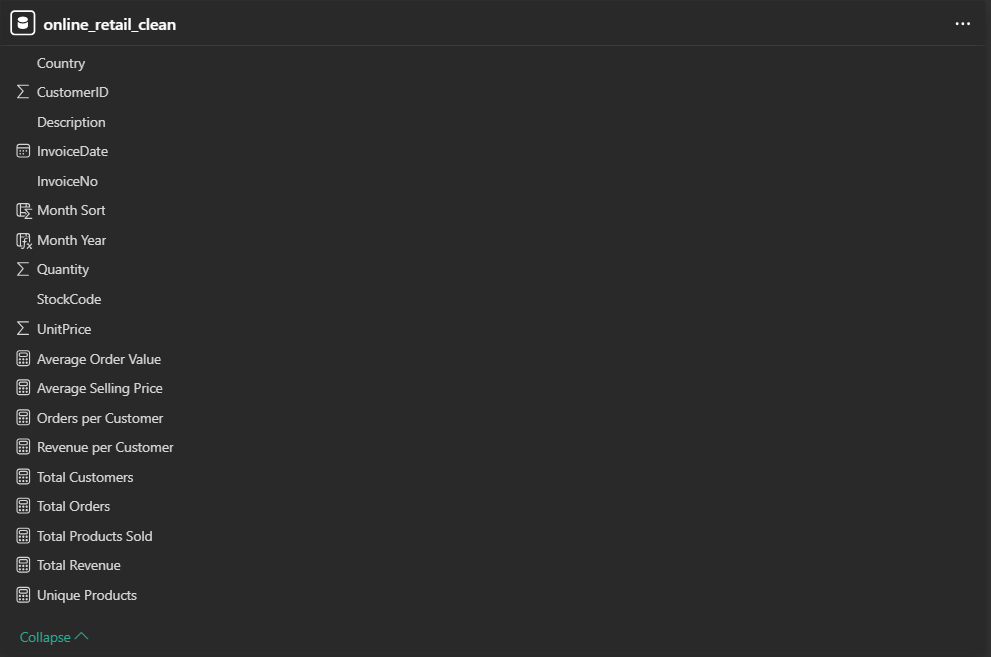
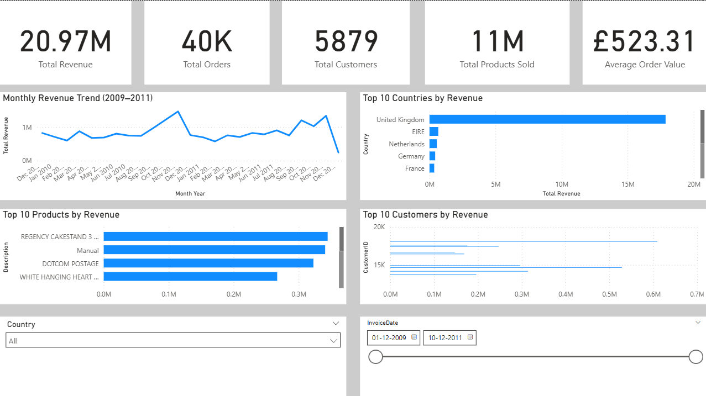
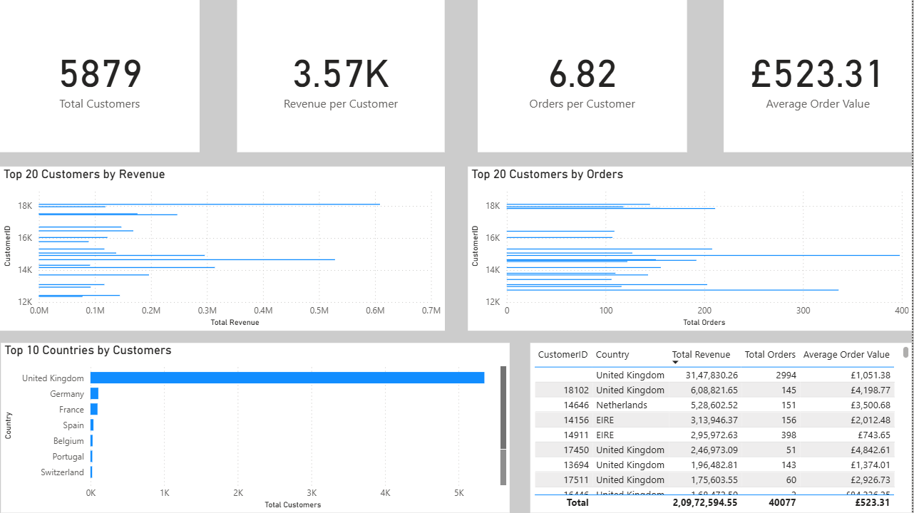
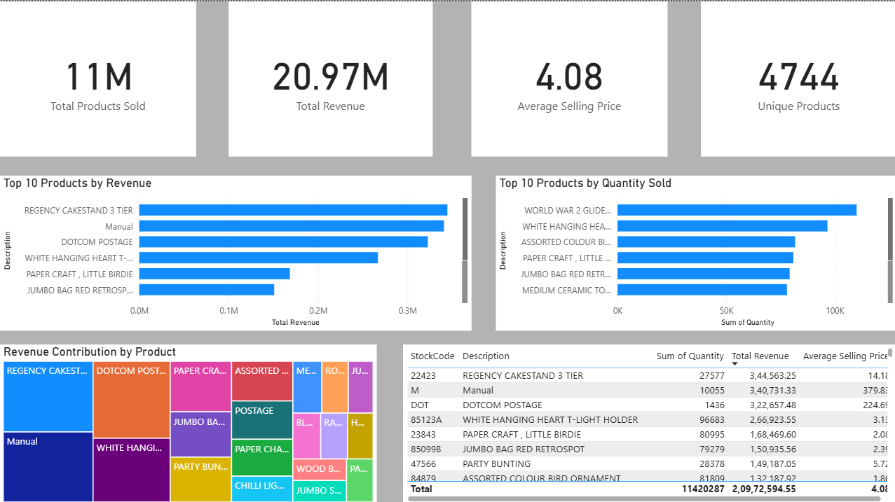
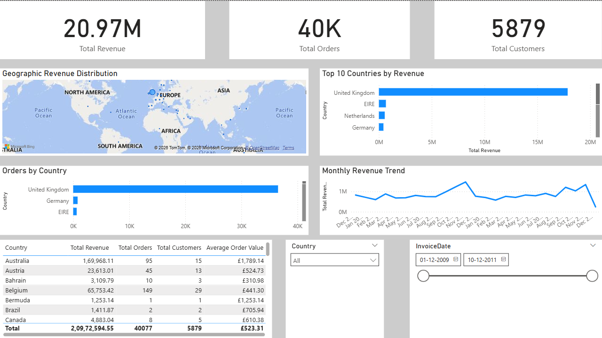

# Enterprise E-Commerce Analytics Platform

<p align="center">


</p>

---

# Project Overview

The **Enterprise E-Commerce Analytics Platform** is an end-to-end Business Intelligence project developed using **SQL**, **Power BI**, and **DAX**.

The objective of this project is to convert raw retail transaction data into meaningful business insights through a structured analytics workflow. The project covers the complete lifecycle of a data analytics solution—from data import and cleaning to dashboard development and KPI reporting.

Rather than focusing only on visualization, the project demonstrates how SQL and Power BI work together to support business decision-making through interactive reports and performance metrics.

---

# Business Problem

Retail businesses generate thousands of transactions every day. Analyzing raw transactional records manually is inefficient and makes it difficult to answer important business questions.

This project addresses questions such as:

- Which products generate the highest revenue?
- Who are the highest-value customers?
- Which countries contribute the most sales?
- How does revenue change over time?
- What is the average order value?
- Which products are sold most frequently?

The final solution provides interactive dashboards that help answer these questions quickly.

---

#  Project Workflow

```
Raw CSV Files
       │
       ▼
Data Import into MySQL
       │
       ▼
Data Cleaning & Validation
       │
       ▼
Exploratory Data Analysis (SQL)
       │
       ▼
Power BI Data Model
       │
       ▼
DAX Measures
       │
       ▼
Interactive Dashboards
       │
       ▼
Business Insights
```

---

# Technology Stack

| Technology | Purpose |
|------------|---------|
| **MySQL** | Data storage, cleaning and exploratory analysis |
| **Power BI Desktop** | Interactive dashboard development |
| **DAX** | KPI calculations and business measures |
| **Microsoft Excel** | Initial data inspection |

---

# Repository Structure

```
Enterprise-Ecommerce-Analytics-Platform
│
├── dataset
│   └── online_retail_clean.csv
│
├── powerbi
│   └── Online_Retail_Sales_Dashboard.pbix
│
├── sql
│   └── online_retail_analysis.sql
│
├── images
│   ├── executive_dashboard.png
│   ├── customer_analysis.png
│   ├── product_analysis.png
│   ├── geographic_analysis.png
│   └── data_model.png
│
└── README.md
```

---

# Key Features

- End-to-end analytics workflow
- SQL-based data cleaning
- Exploratory Data Analysis (EDA)
- Interactive Power BI dashboards
- DAX KPI calculations
- Customer Analysis
- Product Analysis
- Geographic Analysis
- Executive Dashboard
- Dynamic slicers and filters
- Business insight generation

---

# Dashboard Overview

The Power BI report consists of **four interactive dashboard pages**:

| Dashboard | Purpose |
|-----------|---------|
| Executive Dashboard | High-level business performance monitoring |
| Customer Analysis | Customer purchasing behavior and revenue contribution |
| Product Analysis | Product performance and sales contribution |
| Geographic Analysis | Country-wise revenue and sales trends |

# Dataset Description

The project uses the **Online Retail** transactional dataset containing customer purchase records from **December 2009 to December 2011**. The data represents invoices generated by a UK-based online retailer selling products to customers across multiple countries.

### Dataset Attributes

| Column      | Description                                |
| ----------- | ------------------------------------------ |
| InvoiceNo   | Unique invoice number for each transaction |
| StockCode   | Unique identifier assigned to each product |
| Description | Product description                        |
| Quantity    | Number of units purchased                  |
| InvoiceDate | Date and time of the transaction           |
| UnitPrice   | Selling price per unit                     |
| CustomerID  | Unique customer identifier                 |
| Country     | Customer's country                         |

---

# Database Development

Two raw retail datasets covering different time periods were imported into **MySQL**. Both datasets were validated individually before being merged into a single master table for analysis.

The workflow included:

* Importing CSV files into MySQL
* Defining appropriate data types
* Converting invoice dates into DATETIME format
* Creating separate tables for each dataset
* Combining both datasets into a master table using `UNION ALL`
* Validating record counts after merging

---

# Data Cleaning

Before starting the analysis, the dataset was cleaned to remove inconsistencies and improve reporting accuracy.

The following checks were performed:

| Validation           | Action                                  |
| -------------------- | --------------------------------------- |
| Duplicate Records    | Identified and removed                  |
| Cancelled Invoices   | Removed (`InvoiceNo` starting with `C`) |
| Negative Quantity    | Removed                                 |
| Zero Unit Price      | Removed                                 |
| Missing Customer IDs | Excluded from customer-level analysis   |
| Date Format          | Standardized into SQL DATETIME format   |

A new table named **`online_retail_clean`** was created and used throughout the Power BI dashboards.

---

# Exploratory Data Analysis (SQL)

Exploratory analysis was performed using SQL to understand sales performance and customer behavior.

### Business Questions Answered

### Sales KPIs

* Total Revenue
* Total Orders
* Total Customers
* Total Products Sold
* Average Order Value
* Average Selling Price

### Time-Based Analysis

* Monthly Revenue Trend
* Monthly Orders
* Highest Revenue Month
* Revenue by Quarter
* Revenue by Weekday
* Revenue by Hour

### Customer Analysis

* Top Customers by Revenue
* Customer Purchase Frequency
* Orders per Customer

### Product Analysis

* Top Products by Revenue
* Lowest Revenue Products
* Products with Highest Average Selling Price

### Geographic Analysis

* Revenue by Country
* Orders by Country
* Customer Distribution by Country

---

# DAX Measures

To support interactive reporting in Power BI, several reusable DAX measures were created.

| Measure               | Purpose                               |
| --------------------- | ------------------------------------- |
| Total Revenue         | Calculates overall sales revenue      |
| Total Orders          | Counts unique invoices                |
| Total Customers       | Counts unique customers               |
| Total Products Sold   | Calculates total quantity sold        |
| Average Order Value   | Revenue generated per order           |
| Average Selling Price | Average unit selling price            |
| Revenue per Customer  | Revenue generated per customer        |
| Orders per Customer   | Average number of orders per customer |
| Unique Products       | Counts distinct products              |

These measures are reused across multiple report pages to ensure consistent business calculations.

---

# Data Model

The Power BI report uses a cleaned transactional table as the primary analytical dataset.

The model consists of:

* Clean retail transaction table
* Business KPI measures
* Time-based calculations
* Interactive slicers
* Reusable DAX measures

The complete model is shown below.



---

# Power BI Features Implemented

The dashboards include several interactive features to improve usability.

* Interactive slicers
* Cross-filtering between visuals
* Dynamic KPI cards
* Top N filtering
* Geographic map visualization
* Treemap visualization
* Drill-down capability
* Responsive dashboard layouts

---

# Business Value

The dashboards provide a consolidated view of business performance, enabling users to:

* Monitor sales performance over time
* Identify high-value customers
* Evaluate product performance
* Compare revenue across countries
* Analyze purchasing trends
* Support business decision-making through interactive reporting
# Dashboard Walkthrough

The Power BI report is divided into four interactive dashboards, each designed to answer a different set of business questions. Together, these dashboards provide a comprehensive view of sales performance, customer behavior, product performance, and geographic trends.

---

# Dashboard 1 – Executive Dashboard

The Executive Dashboard provides a high-level summary of overall business performance. It is intended for business users who need to monitor key performance indicators at a glance.

### KPIs

* Total Revenue
* Total Orders
* Total Customers
* Total Products Sold
* Average Order Value

### Visualizations

* Monthly Revenue Trend
* Top 10 Countries by Revenue
* Top 10 Products by Revenue
* Top 10 Customers by Revenue
* Country Slicer
* Date Slicer

### Business Questions Answered

* How much revenue has the business generated?
* How many orders have been placed?
* How many customers made purchases?
* Which countries contribute the highest revenue?
* How has revenue changed over time?

<p align="center">

</p>

---

# Dashboard 2 – Customer Analysis

This dashboard focuses on customer purchasing behavior and helps identify high-value customers.

### KPIs

* Total Customers
* Revenue per Customer
* Orders per Customer
* Average Order Value

### Visualizations

* Top 20 Customers by Revenue
* Top 20 Customers by Orders
* Top Countries by Customer Count
* Customer Detail Table

### Business Questions Answered

* Who are the highest-value customers?
* Which customers place the most orders?
* Which countries have the largest customer base?
* How much revenue does each customer generate on average?

<p align="center">

</p>

---

# Dashboard 3 – Product Analysis

The Product Analysis dashboard evaluates product performance and identifies the products driving business revenue.

### KPIs

* Total Products Sold
* Total Revenue
* Average Selling Price
* Unique Products

### Visualizations

* Top 10 Products by Revenue
* Top 10 Products by Quantity Sold
* Revenue Contribution Treemap
* Product Detail Table

### Business Questions Answered

* Which products generate the highest revenue?
* Which products sell the highest quantity?
* How much does each product contribute to total revenue?
* What is the average selling price of products?

<p align="center">

</p>

---

# Dashboard 4 – Geographic Analysis

The Geographic Analysis dashboard compares sales performance across different countries and highlights regional trends.

### KPIs

* Total Revenue
* Total Orders
* Total Customers

### Visualizations

* Revenue Distribution Map
* Top Countries by Revenue
* Orders by Country
* Monthly Revenue Trend
* Country Summary Table
* Country & Date Slicers

### Business Questions Answered

* Which countries contribute the highest revenue?
* How are customer orders distributed geographically?
* Which regions show the strongest sales performance?
* How does revenue vary across countries over time?

<p align="center">

</p>

---

# Key Business Insights

Analysis of the retail dataset revealed several meaningful business insights:

* The United Kingdom accounts for the largest share of total revenue.
* A relatively small group of customers contributes a significant percentage of overall sales.
* A limited number of products generate a substantial portion of business revenue.
* Revenue exhibits noticeable monthly fluctuations, indicating seasonal purchasing behavior.
* International sales are concentrated within a few key markets, while many countries contribute comparatively smaller volumes.

---

# Skills Demonstrated

This project demonstrates practical experience in:

* SQL Query Writing
* Data Cleaning and Validation
* Exploratory Data Analysis (EDA)
* Data Transformation
* Business KPI Development
* DAX Measure Creation
* Power BI Dashboard Design
* Interactive Data Visualization
* Business Intelligence Reporting
* Analytical Problem Solving


Follow these steps to run the project locally.

## Prerequisites

Make sure the following software is installed:

* MySQL Server
* MySQL Workbench
* Microsoft Power BI Desktop

---

## Installation

### 1. Clone the Repository

```bash
git clone https://github.com/YOUR_USERNAME/Enterprise-Ecommerce-Analytics-Platform.git
```

---

### 2. Import the Dataset

Import the cleaned dataset into MySQL or use the provided SQL scripts to recreate the database.

Dataset location:

```
dataset/online_retail_clean.csv
```

---

### 3. Execute SQL Scripts

Run the SQL script available inside the **sql** folder.

```
sql/online_retail_analysis.sql
```

The script includes:

* Data Cleaning
* Data Validation
* Exploratory Data Analysis
* Business Queries

---

### 4. Open the Power BI Report

Open

```
powerbi/Online_Retail_Sales_Dashboard.pbix
```

Refresh the data source if required.

---

#  Project Structure

```
Enterprise-Ecommerce-Analytics-Platform/
│
├── dataset/
│   └── online_retail_clean.csv
│
├── powerbi/
│   └── Online_Retail_Sales_Dashboard.pbix
│
├── sql/
│   └── online_retail_analysis.sql
│
├── screenshots/
│   ├── executive_dashboard.png
│   ├── customer_analysis.png
│   ├── product_analysis.png
│   ├── geographic_analysis.png
│   └── data_model.png
│
└── README.md
```

---

#  Project Highlights

* End-to-end Business Intelligence workflow
* SQL-based data cleaning and preprocessing
* Exploratory Data Analysis using MySQL
* Interactive Power BI dashboards
* DAX measures for KPI calculation
* Customer, Product, Executive, and Geographic analysis
* Interactive slicers and filters
* Professional dashboard design

---

#  Future Enhancements

The following improvements can be added in future versions of the project:

* Customer segmentation using RFM Analysis
* Sales forecasting using time-series models
* Product category performance analysis
* Profit and margin analysis
* Inventory optimization dashboard
* Drill-through pages
* Row-Level Security (RLS)
* Power BI Service deployment with scheduled refresh


# Author

## Banoth.Sri Kowshika Raj

**B.Tech – Computer Science and Engineering**

**Indian Institute of Technology Jodhpur**

Email: **[kowshikaraj537@gmail.com](mailto:kowshikaraj537@gmail.com)**

LinkedIn

https://www.linkedin.com/in/sri-kowshika-raj-banoth/

 GitHub

https://github.com/Kowshikaraj

---


